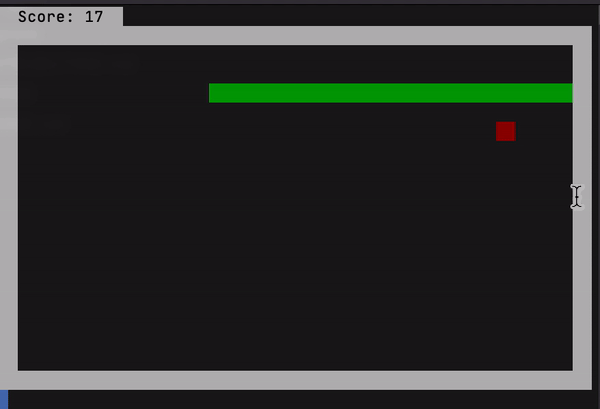

# Term Snake

A snake game for the terminal. A great way to waste some time.




## Installation

**Compile the program manually**

```bash
git clone https://github.com/jomy10/term-snake
cd term-snake/main
go build -o snake -ldflags "-s -w"
mv snake /usr/bin/local
```

**Download latest release**

Go to the [GitHub release section](https://github.com/jomy10/term-snake/releases) and download the latest release for your operating system

## Features

A snake game that occupies the whole terminal screen.

## Motivation

This is my first project in Go, I made this program to learn the language.

## Room for improvement

- The snake could go faster everytime it eats
- Store highscore
- Customization
    - Loop when hiting a wall
    - Colors and sprites
    - Welcome/menu screen

## Usage

```bash
$ snake
```

- Use *wasd/zqsd* to move.
- Use *c* to exit

## Contributing

Read the [Contributing guidelines](CONTRIBUTING.md).

## License

Licensed under the [MIT License](LICENSE).
